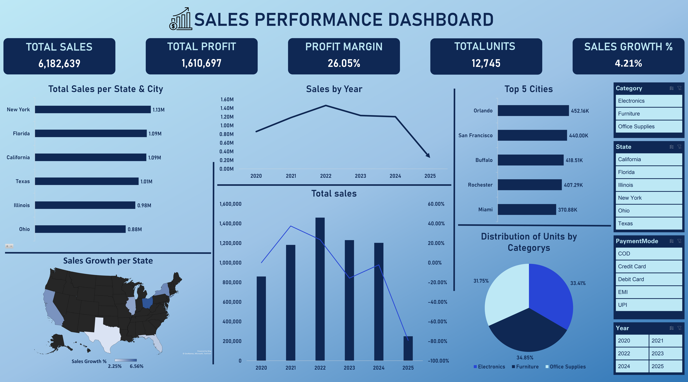

# 📊 Executive Sales & Profitability Dashboard (2020 - 2025)

## 📋 Project Overview
This project is an end-to-end Data Analytics solution designed to transform raw transactional data into actionable business intelligence. Bridging my operational experience at **Amazon Business** with my studies in **Decision Support** at Cairo University, I built this dashboard to help stakeholders track regional performance, analyze category profitability, and monitor long-term growth trends.

## 💡 Key Business Insights
Through this analysis, I identified the following performance metrics:
* **Total Revenue:** $6,182,639
* **Total Profit:** $1,610,697
* **Profit Margin:** 26.05%
* **Sales Growth:** 4.21% (Measured via Time Intelligence)
* **Top Markets:** New York City, Austin, and Los Angeles were identified as the primary revenue drivers.

## 🛠️ Technical Workflow
### 1. Data Cleaning & ETL
* Processed over 1,200 records using **Power Query**.
* Handled date standardization and data type formatting to ensure accuracy in multi-year reporting.

### 2. Data Modeling (Power Pivot)
* Implemented a **Star Schema** relational model.
* Established 1-to-many relationships between the `Sales` fact table and a custom `Calendar` dimension table to enable advanced time-based analysis.

### 3. DAX Engineering
Developed custom Data Analysis Expressions (DAX) for dynamic reporting:
* **Total Sales:** `SUM(Sales[Amount])`
* **Profit Margin %:** `DIVIDE([Total Profit], [Total Sales], 0)`
* **YoY Growth:** Utilized `SAMEPERIODLASTYEAR` to compare performance across fiscal years.

### 4. Interactive Visualization
* Designed a corporate-grade UI with a focus on User Experience (UX).
* Integrated **Slicers** for State, Category, and Payment Mode, allowing for instant "drill-down" analysis.

## 📂 Repository Contents
* `Power (version 2).xlsx`: The finalized dashboard including the Data Model and Pivot Charts.
* `Sales_Dataset.csv`: The raw source data used for this analysis.

---
## 👤 Contact
**Moamen Soliman** *Computer Science Student (Decision Support & Operations Research) @ Cairo University* 
📫 **Email:** moamenbellah0508295314@gmail.com  
🔗 **LinkedIn:** [linkedin.com/in/moamen-soliman-17826323b](https://www.linkedin.com/in/moamen-soliman-17826323b)
